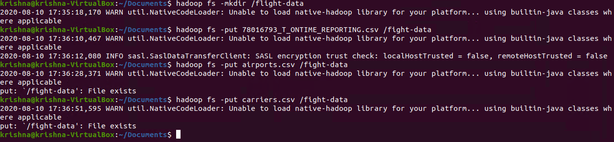
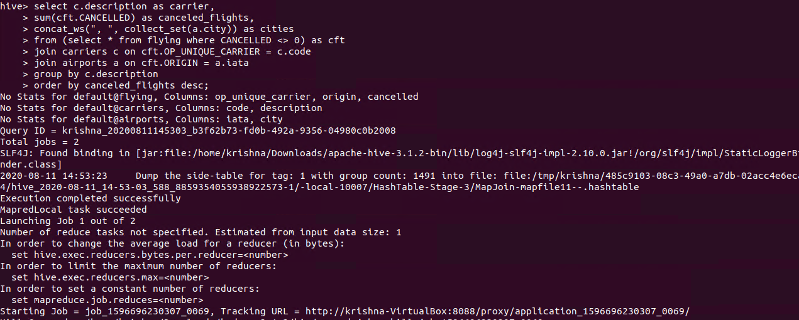
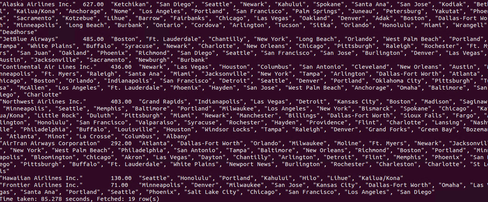

# HIVE Flight Carriers Airports Data Explore
-----------------------

### HIVE

* Hive gives a SQL-like interface to manage data. It is used in Amazon H3 file system. It also support HiveQL. Hive implicitly codeword hiveQL statement into Adirected acyclic graph of mapreduce those the spark jobs.  
* It support Advance features such as indices, partition, buckets, asummetric transactions, custom user defined functions, joins, sampling & many others. Lots of them take a considerable amount of time if implemented manually.  

### Create directory in Hadoop

  

In the above screenshot, I have created directory “/flight-data” in HDFS.  

### Copy file to Hadoop File System

  

In the above screenshot, I have put Dataset file to HDFS directory “/flight-data”.  

### Create table in hive
 
  

In the above screenshot, I have created table “flying”.

### Load Data into table flying
 
  

In the above screenshot, I have loaded data into table.  
**load data:** load data command  
**Inpath ‘/flight-data/78*’:** path where data is present  
**Into table flying:** table ipinyou to store data  

### Create table airports in hive
 
  

In the above screenshot, I have created table “airports”.  

### Load Data into table airports

  

In the above screenshot, I have loaded data into table airports.
**load data:** load data command 
**Inpath ‘/flight-data/airports.csv’:** path where data is present
**Into table airports:** table ipinyou to store data

### Create table carriers in hive

  
 
In the above screenshot, I have created table “carriers”.  

### Load Data into table carriers

  

In the above screenshot, I have loaded data into table airports.
**load data:** load data command 
**Inpath ‘/flight-data/carriers.csv’:** path where data is present
**Into table carriers:** table carriers to store data

### 1.	Find all carriers who cancelled more than 1 flights during 2007, order them from biggest to lowest by number of cancelled flights and list in each record all departure cities where cancellation happened.

**Created by:**  
**Name: Krishna Kumar Singh**  
**Email: krishnaai265@gmail.com**  
**Phone: +91-9368754996** 
